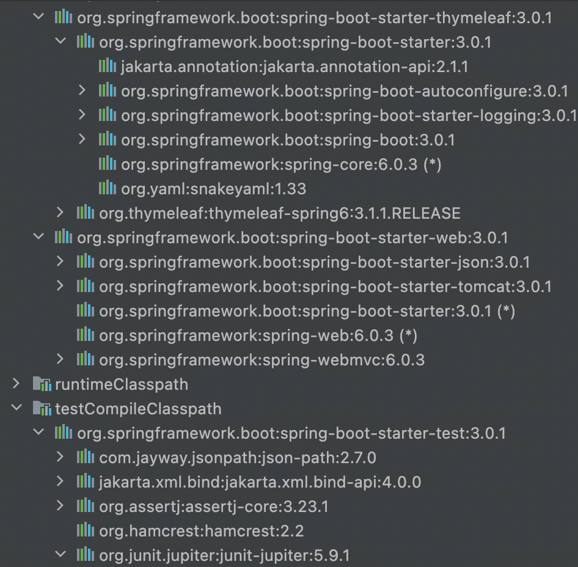
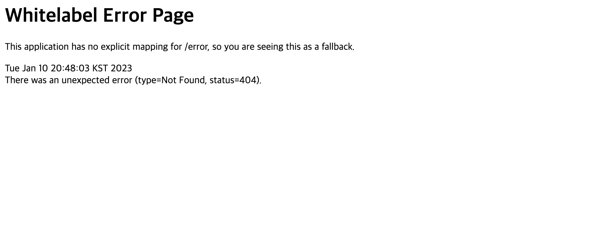

[Spring 입문](https://omjinlts.github.io/dev/spring-study/)

## 프로젝트 생성

### 준비

강의 상에서는 `Java 11`을 권장했지만, `Spring boot 3.0` 이상에서는 17버전이 요구되기에 17버전을 사용했다.

IDE로는 `IntelliJ`를 사용하기로 했다.

### 스프링 부트 스타터

[start.spring.io](https://start.spring.io) 를 이용해 프로젝트 초기 생성을 진행한다.

`Gradel - Groovy`, `Spring Boot 3.0.1`로 진행했고, \
Dependencies(의존성)의 경우 강의에 따라 `Spring Web`, `Thymeleaf`를 추가했다.


## 라이브러리 살펴보기

`build.gradle` 을 살펴보면, 다음과 같이 위에서 추가해 주었던 라이브러리들을 확인 할 수 있다. 해당 라이브러리에서 필요한 의존성들의 경우 자동으로 추가되게 되어 외부에서 확인해 볼 수 있다.

```groovy
dependencies {
	implementation 'org.springframework.boot:spring-boot-starter-thymeleaf'
	implementation 'org.springframework.boot:spring-boot-starter-web'
	testImplementation 'org.springframework.boot:spring-boot-starter-test'
}
```

다음과 같이 Gradle로 다운로드 된 라이브러리들을 IntelliJ에서 확인 해 보면, \
logging, tomcat, junit 등 로깅, 서버, 테스트 등에 필요한 다양한 필수적인 의존성들이 추가되어 있음으로 확인할 수 있다.



## View 환경설정

### Welcome page

앞서 생성한 프로젝트를 실행시킨 후 `localhost:8080` 에 접속해 보면 다음과 같은 에러 페이지를 마주하게 된다.



그 이유는 url에 해당하는(매핑된) 페이지가 없기 때문인데, `static/index.html` 을 통해 `Welcome page` 를 만들어 줄 수 있다.

> Spring boot가 제공하는 기능이다.

// TODO

## 빌드

// TODO
