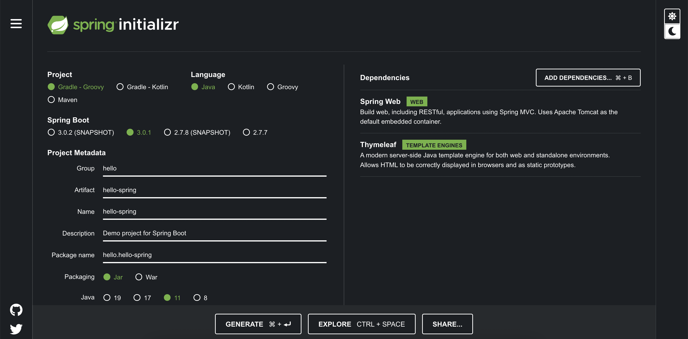
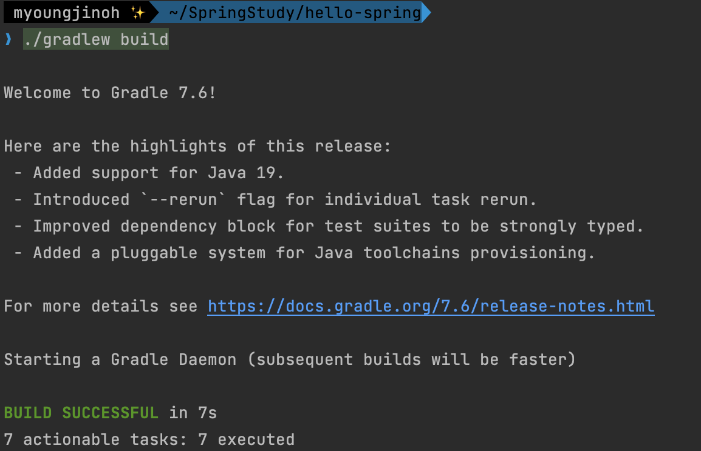

> [Spring 입문](https://omjinlts.github.io/dev/spring-study/)

## 프로젝트 생성

### 준비

강의 상에서는 `Java 11`을 권장했지만, `Spring boot 3.0` 이상에서는 17버전이 요구되기에 17버전을 사용했다.

IDE로는 `IntelliJ`를 사용하기로 했다.

### 스프링 부트 스타터

[start.spring.io](https://start.spring.io) 를 이용해 프로젝트 초기 생성을 진행한다.

`Gradel - Groovy`, `Spring Boot 3.0.1`로 진행했고, \
Dependencies(의존성)의 경우 강의에 따라 `Spring Web`, `Thymeleaf`를 추가했다.



## 라이브러리 살펴보기

`build.gradle` 을 살펴보면, 다음과 같이 위에서 추가해 주었던 라이브러리들을 확인 할 수 있다. 해당 라이브러리에서 필요한 의존성들의 경우 자동으로 추가되게 되어 외부에서 확인해 볼 수 있다.

```groovy
dependencies {
	implementation 'org.springframework.boot:spring-boot-starter-thymeleaf'
	implementation 'org.springframework.boot:spring-boot-starter-web'
	testImplementation 'org.springframework.boot:spring-boot-starter-test'
}
```

다음과 같이 Gradle로 다운로드 된 라이브러리들을 IntelliJ에서 확인 해 보면, \
logging, tomcat, junit 등 로깅, 서버, 테스트 등에 필요한 다양한 필수적인 의존성들이 추가되어 있음으로 확인할 수 있다.


## View 환경설정

### Welcome page

앞서 생성한 프로젝트를 실행시킨 후 `localhost:8080` 에 접속해 보면 다음과 같은 에러 페이지를 마주하게 된다.

> 

그 이유는 url에 해당하는(매핑된) 페이지가 없기 때문인데, `static/index.html` 을 통해 `Welcome page` 를 만들어 줄 수 있다.

_Spring boot가 제공하는 기능이다. [참고](https://docs.spring.io/spring-boot/docs/2.3.1.RELEASE/reference/html/spring-boot-features.html#boot-features-spring-mvc-welcome-page)_

`index.html`을 다음과 같이 생성해 주면 시작페이지가 생성된다.

> resources/static/index.html
>
> ```html
> <!DOCTYPE html>
> <html>
>   <head>
>     <title>Hello</title>
>     <meta http-equiv="Content-Type" content="text/html; charset=UTF-8" />
>   </head>
>   <body>
>     Hello
>     <a href="/hello">hello</a>
>   </body>
> </html>
> ```

> 

### Thymeleaf

`Thymeleaf`는 Spring Boot에서 권장하는 템플릿 엔진의 일종이다.\
템플릿 엔진은 동적인 html 컨텐츠를 제공할 수 있게 해주는 역할을 한다.

위의 welcome page의 경우 데이터와 무관하게 이미 적재된 html 문서가 그대로 로드되는 정적 페이지이고, `Thymeleaf`를 이용해 템플릿으로 생성한 페이지의 경우 데이터를 불러와 문서를 가공한 후 보여주게 되는 동적 페이지가 된다.

`hello` 페이지의 템플릿을 먼저 만들자.

> resources/templates/hello.html
>
> ```html
> <!DOCTYPE html>
> <html xmlns:th="http://www.thymeleaf.org">
>   <head>
>     <title>Hello</title>
>     <meta http-equiv="Content-Type" content="text/html; charset=UTF-8" />
>   </head>
>   <body>
>     <p th:text="'안녕하세요. ' + ${data}">안녕하세요. 손님</p>
>   </body>
> </html>
> ```

`xmlns:th="http://www.thymeleaf.org"` 를 통해 `Thymeleaf` 를 불러오고 있음을 확인 할 수 있다.  
8번 줄에서 `th:text` 타임리프 문법이 사용되었음을 확인 할 수 있다.

`Thymeleaf`와 관련된 더 자세한 사항은  
[Thymeleaf 공식 사이트](https://www.thymeleaf.org/), [스프링 공식 매뉴얼](https://spring.io/guides/gs/serving-web-content/), [스프링부트 매뉴얼](https://docs.spring.io/spring-boot/docs/2.3.1.RELEASE/reference/html/spring-boot-features.html#boot-features-spring-mvc-template-engines)에서 찾아볼 수 있다.

그리고, 위의 페이지에 접근하기 위해 controller를 만들어주어야 한다.

main 함수가 존재하는 `HelloSpringApplication.java` 와 같은 디렉터리에 새로운 `controller` 패키지를 생성한 뒤, `helloController.java`를 만들어 주자.

> controller/helloController.java
>
> ```java
> package hello.hellospring.controller;
>
> import org.springframework.stereotype.Controller;
> import org.springframework.ui.Model;
> import org.springframework.web.bind.annotation.GetMapping;
>
> @Controller // Controller임을 알려주는 annotation
> public class HelloController {
>    @GetMapping("hello") // /hello로 들어오면
>    public String hello(Model model) {
>        model.addAttribute("data", "hello~");
>        return "hello";
>    }
> }
> ```

웹 브라우저에서 `localhost:8080/hello`로 접근 요청을 하면, 스프링부트의 내장 톰캣 서버에서 이를 확인해 `helloController`를 호출하고, 여기서 return된 `hello`를 `viewResolver`가 찾아 `templates/hello.html`을 Thymeleaf로 처리한 뒤 보여주게 된다.  
서버를 다시 실행한 뒤 welcome page에서 `hello` 를 눌러 `localhost:8080/hello` 로 이동하게 되면 다음과 같이 정상 작동함을 확인할 수 있다.

> 

## 빌드

`gradlew` 를 통해 빌드가 가능하다.

```bash
./gradlew build
```



위와 같이 빌드가 완료되면, `libs` 안에 `.jar` 로 빌드된 파일이 생성된다.  
여타 자바 프로그램들과 동일하게 `java -jar *.jar` 로 실행할 수 있다.

빌드에 실패한다면, `./gradlew clean build` 를 통해 기존의 빌드를 지우고 다시 시도해 보자.

> [Spring 입문](https://omjinlts.github.io/dev/spring-study/)
