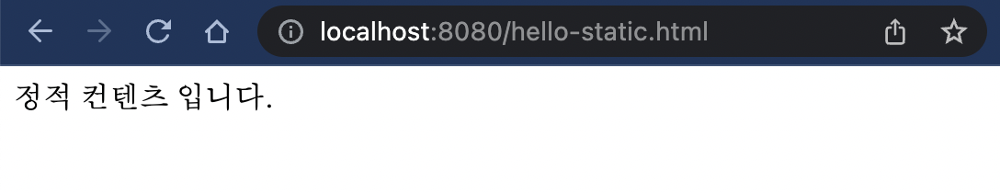
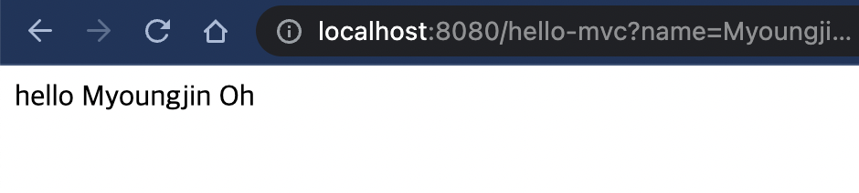

> [Spring 입문](https://omjinlts.github.io/dev/spring-study/)

## 정적 컨텐츠

`정적 컨텐츠(static content)` 에서는 이름 그대로 정적인, 즉 이미 적재된 콘텐츠를 그대로 불러와 보여주게 된다.

Spring Boot에서는 정적 컨텐츠 기능을 지원하는데, [공식 문서](https://docs.spring.io/spring-boot/docs/2.3.1.RELEASE/reference/html/spring-boot-features.html#boot-features-spring-mvc-static-content)에서 확인해 볼 수 있다.

직접 정적 컨텐츠를 만들어 보자.

> `resources/static/hello-static.html`
>
> ```html
> <!DOCTYPE html>
> <html>
>   <head>
>     <title>static content</title>
>     <meta http-equiv="Content-Type" content="text/html; charset=UTF-8" />
>   </head>
>   <body>
>     정적 컨텐츠 입니다.
>   </body>
> </html>
> ```

이후 서버를 다시 실행 후 `localhost:8080/hello-static.html` 에 접근해 보면 아래와 같이 잘 작동함을 확인할 수 있다.

> 

> 웹 브라우저에서 `localhost:8080/hello-static.html`을 통해 톰캣 내장 서버에 요청을 보내게 되면, 우선적으로 스프링 컨테이너에서 `hello-static` 과 관련된 컨트롤러의 존재 여부를 판단하고, 컨트롤러가 없기에 빠져 나와 `resources/static/hello-static.html` 을 브라우저에 보내주게 된다.

## MVC와 템플릿 엔진

앞서 살펴보았던 [Thymeleaf 예제](https://omjinlts.github.io/dev/spring-01/#thymeleaf)의 경우에 해당하는 부분이다.

`MVC` 는 `Model, View, Controller` 의 앞글자를 따서 만들어진 약자인데, 데이터가 정의되는 `Model`, 화면을 구성하는 `View`, 사용자와의 상호작용과 모델/뷰의 업데이트 등의 로직을 담당하는 뒷단인 `Controller` 로 소프트웨어를 구성하는 패턴이다.  
MDN 문서에 잘 정리되어 있으니 [참고](https://developer.mozilla.org/ko/docs/Glossary/MVC)로 읽어보면 좋을 것 같다.

이전에 만들었던 `helloController.java` 에 다음 메서드를 추가해 보자.

> `controller/HelloController.java`
>
> ```java
>  @GetMapping("hello-mvc")
>  public String helloMvc(@RequestParam("name") String name, Model model) {
>      model.addAttribute("name", name);
>      return "hello-template";
>  }
> ```

`View` 에 해당하는 `hello-template` 또한 만들어주자.

> `resources/templates/hello-template.html`
>
> ```html
> <html xmlns:th="http://www.thymeleaf.org">
>   <body>
>     <p th:text="'hello ' + ${name}">hello! empty</p>
>   </body>
> </html>
> ```

`http://localhost:8080/hello-mvc?name=Myoungjin%20Oh` 를 통해 접근해보자.

> 

주의할 점은 `@RequestParam("name")` 을 통해 파라미터를 지정해 주었기 때문에 꼭 `?name={원하는 이름}` 으로 지정해 주어야 한다. 이름이 바뀌면 내용도 바뀌게 된다.

만약 `http://localhost:8080/hello-mvc` 로 접근하게 되면 파라미터가 없어 오류가 나게 되는데, 이 경우 컨트롤러를 다음과 같이 수정해 주어 해결할 수 있다.

> `controller/HelloController.java`
>
> ```java
>  @GetMapping("hello-mvc")
>  public String helloMvc(@RequestParam(value = "name", required = false) String name, Model model) {
>      model.addAttribute("name", name);
>      return "hello-template";
>  }
> ```

브라우저에서 요청을 보내게 되면 톰캣 내장 서버를 거쳐 컨트롤러로 이동해 `hello-template` return을 통해 `hello-template.html` 을 받아온 모델을 이용해 Thymeleaf 엔젠이 처리해 `viewResolver` 를 거쳐ㄴ html로 변환 후 브라우저에 띄우게 된다.

## API

> [Spring 입문](https://omjinlts.github.io/dev/spring-study/)

```

```
