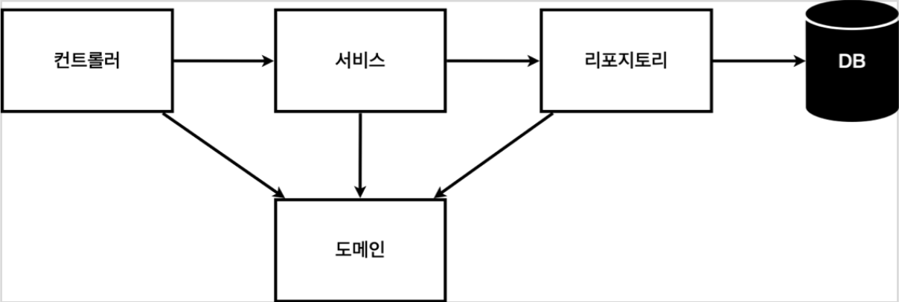
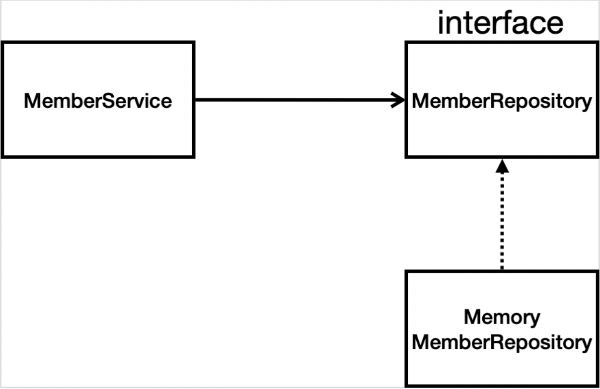

> [Spring 입문](https://omjinlts.github.io/dev/spring-study/)

> 이번 섹션에서는 회원 관리 예제를 만들어보게 된다.

## 비즈니스 요구사항 정리

### 예제 시나리오

- 데이터: 회원ID, 이름
- 기능: 회원 등록, 조회
- 아직 데이터 저장소가 선정되지 않음(가상의 시나리오)

### 일반적인 웹 애플리케이션 계층 구조



- 컨트롤러: 웹 MVC의 컨트롤러 역할
- 서비스: 핵심 비즈니스 로직 구현
- 리포지토리: 데이터베이스에 접근, 도메인 객체를 DB에 저장하고 관리
- 도메인: 비즈니스 도메인 객체, 예) 회원, 주문, 쿠폰 등등 주로 데이터베이스에 저장하고 관리됨

### 클래스 의존관계



- 아직 데이터 저장소가 선정되지 않아서, 우선 인터페이스로 구현 클래스를 변경할 수 있도록 설계
- 데이터 저장소는 RDB, NoSQL 등등 다양한 저장소를 고민중인 상황으로 가정
- 개발을 진행하기 위해서 초기 개발 단계에서는 구현체로 가벼운 메모리 기반의 데이터 저장소 사용

## 회원 도메인과 리포지토리 만들기

### 도메인

`domain` 패키지 생성 후 `Member.java` 클래스를 생성해 준다.  
요구사항에 맞게 `id`, `name` 을 만들어 준다.

> `hello/hellospring/domain/Member.java`
>
> ```java
> package hello.hellospring.domain;
>
> public class Member {
>    private Long id;
>    private String Name;
>
>    public Long getId() {
>        return id;
>    }
>
>    public void setId(Long id) {
>        this.id = id;
>    }
>
>    public String getName() {
>        return Name;
>    }
>
>    public void setName(String name) {
>        Name = name;
>    }
> }
> ```

### 레포지토리

`repository` 패키지 생성 후 `MemberRepository.java` 인터페이스를 생성해 준다.  
요구사항에 맞게 인터페이스를 만들어 준 후, `MemoryMemberRepository.java` 로 구현까지 해 주자.

> `hello/hellospring/repository/MemberRepository.java`
>
> ```java
> package hello.hellospring.repository;
>
> import hello.hellospring.domain.Member;
>
> import java.util.List;
> import java.util.Optional;
>
> public interface MemberRepository {
>    Member save(Member member);
>    Optional<Member> findById(Long id);
>    Optional<Member> findByName(String name);
>    List<Member> findAll();
> }
> ```

> `hello/hellospring/repository/MemoryMemberRepository.java`
>
> ```java
> package hello.hellospring.repository;
>
> import hello.hellospring.domain.Member;
>
> import java.util.*;
>
> public class MemoryMemberRepository implements MemberRepository{
>
>    private static Map<Long, Member> store = new HashMap<>();
>    private static long sequence = 0L;
>
>    @Override
>    public Member save(Member member) {
>        member.setId(++sequence);
>        store.put(member.getId(), member);
>        return member;
>    }
>
>    @Override
>    public Optional<Member> findById(Long id) {
>        return Optional.ofNullable(store.get(id));
>    }
>
>    @Override
>    public Optional<Member> findByName(String name) {
>        return store.values().stream()
>                .filter(member -> member.getName().equals(name))
>                .findAny();
>    }
>
>    @Override
>    public List<Member> findAll() {
>        return new ArrayList<>(store.values());
>    }
> }
> ```

## 회원 리포지토리 테스트 케이스 작성

작성한 코드가 올바른지 확인하는 테스트 케이스를 작성해 보자.  
주의할 점은 `main` 이 아닌 `test` 디렉토리를 사용해야 한다.

test 시에는 `@Test` 데코러이터를 통해 테스트 함수를 정의해 줄 수 있다.

### save

> `test/java/hello/hellospring/repository/MemorymemberRepositoryTest.java
>
> ```java
> package hello.hellospring.repository;
>
> import hello.hellospring.domain.Member;
> import org.junit.jupiter.api.Test;
>
>
> class MemoryMemberRepositoryTest {
>    MemoryMemberRepository repository = new MemoryMemberRepository();
>
>    @Test
>    public void save() {
>        Member member = new Member();
>        member.setName("testname");
>
>        repository.save(member);
>
>        Member result = repository.findById(member.getId()).get();
>
>        System.out.println("(result == member) = " + (result == member));
>    }
> }
> ```

쉬운 방법으로는 위와 같이 콘솔 출력을 통해 테스트를 할 수 있을 것이다.  
하지만 이는 눈으로 직접 확인해야 하며, 잘못된 경우에도 그대로 빌드가 진행되기에 좋지 못하다.

따라서 `assert` 를 통해 잘못된 경우 에러를 발생시키게 되는데, `org.assertj.core.api.Assertions` 를 사용해 편리하게 한다고 한다.

> ```java
> @Test
> public void save() {
>    Member member = new Member();
>    member.setName("testname");
>
>    repository.save(member);
>
>    Member result = repository.findById(member.getId()).get();
>    assertThat(member).isEqualTo(result);
> }
> ```

여러 테스트가 있을 시, `repository` 에 프로그램 종료시 까지 데이터가 그대로 남아있기에, 다른 테스트에서의 데이터가 남아 맞는 코드임에도 테스트가 틀렸다며 오류가 발생할 수 있다.  
따라서 매 테스트마다 초기화를 해 주어야 한다.

이를 위해 레포지토리에 `clearStore` 를 추가로 만들어준 후, 매 테스트가 끝나면 실행되도록 해 보자.

> `MemoryMemberRepository.java`
>
> ```java
> public void clearStore() {
>        store.clear();
> }
> ```

> `MemoryMemberRepositoryTest.java`
>
> ```java
> @AfterEach
> public void afterEach() {
>    repository.clearStore();
> }
> ```

위의 코드들을 각각 추가해 주면, `@AfterEach` 데코레이터로 인해 매 테스트가 끝날 때 마다 `afterEach()` 가 실행된다.

### findByName

> ```java
> @Test
> public void findByName() {
>    Member member1 = new Member();
>    member1.setName("spring1");
>    repository.save(member1);
>
>    Member member2 = new Member();
>    member2.setName("spring2");
>    repository.save(member2);
>
>    Member result = repository.findByName("spring1").get();
>    assertThat(result).isEqualTo(member1);
> }
> ```

### findAll

> ```java
> @Test
> public void findAll() {
>    Member member1 = new Member();
>    member1.setName("spring1");
>    repository.save(member1);
>
>    Member member2 = new Member();
>    member2.setName("spring2");
>    repository.save(member2);
>
>    List<Member> result = repository.findAll();
>    assertThat(result.size()).isEqualTo(2);
> }
> ```

## 회원 서비스 개발

다시 `main` 으로 돌아가 서비스를 만들어 보자.

### 회원 가입

> `hellospring/service/MemberService.java`
>
> ```java
> package hello.hellospring.service;
>
> import hello.hellospring.domain.Member;
> import hello.hellospring.repository.MemoryMemberRepository;
>
> public class MemberService {
>
>    private final MemoryMemberRepository memberRepository = new MemoryMemberRepository();
>
>    /**
>     * 회원 가입
>     */
>    public long join(Member member) {
>        // 이름 중복 방지
>        validateDuplicatedMember(member);
>
>        memberRepository.save(member);
>        return member.getId();
>    }
>
>    private void validateDuplicatedMember(Member member) {
>        memberRepository.findByName(member.getName())
>                .ifPresent(m -> {
>                    throw new IllegalStateException("이미 존재하는 회원입니다");
>                });
>    }
> }
> ```

### 전체 회원 조회

> ```java
> /**
>  * 전체 회원 조회
>  */
> public List<Member> findMembers() {
>    return memberRepository.findAll();
> }
> ```

### 단일 회원 조회

> ```java
> public Optional<Member> findOne(Long memberId) {
>    return memberRepository.findById(memberId)
> }
> ```

## 회원 서비스 테스트

> [Spring 입문](https://omjinlts.github.io/dev/spring-study/)
